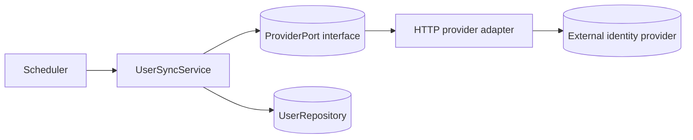

# Example Subsystem — Implementation Reference

> **This is a filled-in example reference doc.** It shows how to document
> *mechanics* (how something currently works) as opposed to *decisions* (which
> belong in an ADR). Replace it with a real subsystem reference, or delete it.

Scope: How the example "User Sync" subsystem is wired, configured, and run. For
the decision behind the layered structure it lives in, see
[`adr/0001-example-layered-architecture.adr.md`](../adr/0001-example-layered-architecture.adr.md).

## Summary

User Sync reconciles local user records with an external identity provider on a
schedule. It runs in the service layer and talks to the provider through a
storage-layer adapter.

## Components

| Component          | Location                     | Responsibility                                  |
| ------------------ | ---------------------------- | ----------------------------------------------- |
| `UserSyncService`  | `service/usersync/`          | Orchestrates a sync run; applies merge rules.   |
| `ProviderPort`     | `service/usersync/port.go`   | Interface the service depends on.               |
| `httpProvider`     | `storage/provider/`          | Adapter that implements `ProviderPort`.         |
| `UserRepository`   | `storage/users/`             | Reads/writes local user rows.                   |

## Configuration

| Setting             | Env var               | Default     | Notes                              |
| ------------------- | --------------------- | ----------- | ---------------------------------- |
| Sync interval       | `USERSYNC_INTERVAL`   | `15m`       | Parsed as a duration.              |
| Provider base URL   | `USERSYNC_BASE_URL`   | _(none)_    | Required; startup fails if unset.  |
| Conflict policy     | `USERSYNC_ON_CONFLICT`| `remote`    | `remote` or `local` wins.          |

## Run sequence

1. The scheduler triggers `UserSyncService.Run(ctx)` every interval.
2. The service fetches the remote snapshot via `ProviderPort`.
3. It loads local users via `UserRepository`.
4. It computes a diff and applies the conflict policy (see **Sync** in
   [`rules/terms.rule.md`](../rules/terms.rule.md)).
5. It writes changes and emits a summary log line.

## Known caveats / rollout notes

- A failed run is retried on the next tick; there is no mid-run retry yet.
- Large provider pages are not streamed; very large tenants may spike memory.
  Tracked in [`plans/backlog.plan.md`](../plans/backlog.plan.md).
