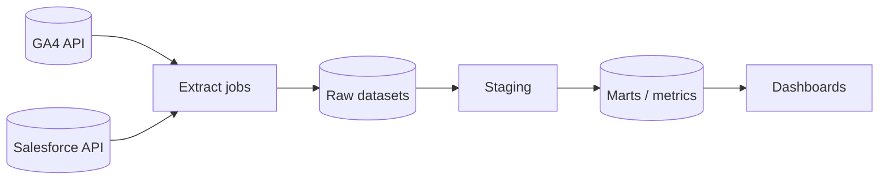

# Operation Connections — Inventory Reference

> **This is a filled-in example reference doc for an operation / data
> repository.** It shows how to document the *connection inventory* — the data
> sources, accounts, and destinations the repo touches — as mechanics (how
> things are wired today), not decisions. It sits alongside the coding example
> [`example-subsystem.ref.md`](example-subsystem.ref.md). Replace it with your
> real inventory, or delete it.

Scope: which data sources and destinations this repo connects to, how each is
authenticated, how often it refreshes, and who owns it. For the decision behind
the layered data flow these connections feed, see
[`../adr/0002-operation-data-layering.adr.md`](../adr/0002-operation-data-layering.adr.md).
For how credentials are handled, see
[`../rules/operation-secrets.rule.md`](../rules/operation-secrets.rule.md).

> **Never put a secret in this file.** List only the **environment variable
> name** that holds each credential, never the value.

## Sources

| Source              | Account / property      | Auth method            | Credential (env var)              | Refresh        | Owner          |
| ------------------- | ----------------------- | ---------------------- | --------------------------------- | -------------- | -------------- |
| Google Analytics 4  | Property `123456789`    | Service account (read) | `GA4_SA_KEY_PATH`                 | Daily 06:00 UTC| Analytics team |
| Salesforce          | Org `acme-prod`         | Connected app (OAuth)  | `SF_CLIENT_ID` / `SF_CLIENT_SECRET`| Hourly        | RevOps         |
| Salesforce sandbox  | Org `acme-sandbox`      | Connected app (OAuth)  | `SF_SANDBOX_CLIENT_ID`            | On demand      | RevOps         |

## Destinations

| Destination | Location                       | Auth method     | Credential (env var) | Notes                                    |
| ----------- | ------------------------------ | --------------- | -------------------- | ---------------------------------------- |
| Warehouse   | BigQuery project `acme-analytics`| Service account | `BQ_SA_KEY_PATH`     | Holds raw, staged, and marts datasets.   |
| Dashboards  | Looker Studio workspace        | Workspace SSO   | _(n/a — UI auth)_    | Read from the marts layer only.          |

## Flow

## Refresh & ownership notes

- Each source has one extract job; see the per-source runbook produced by
  [`../skills/operation-add-data-source/SKILL.md`](../skills/operation-add-data-source/SKILL.md).
- A failed refresh is retried on the next schedule; there is no mid-run retry.
- Mark any source that holds personal data (PII) here and follow
  [`../rules/operation-secrets.rule.md`](../rules/operation-secrets.rule.md).
- Quota caveats and rollout notes for new sources are tracked in
  [`../plans/backlog.plan.md`](../plans/backlog.plan.md).
